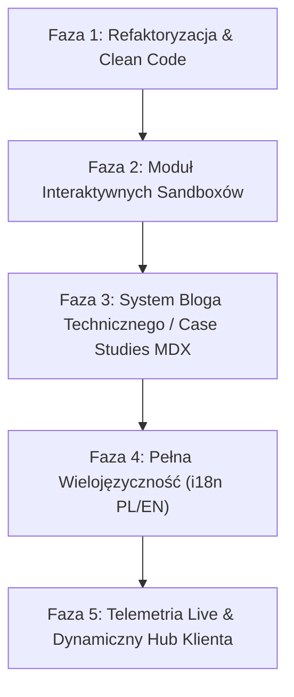

# 🏛️ Audyt Architektoniczny & Strategiczny Plan Rozbudowy GK.dev

**Autor:** Principal Senior Lead Developer & Architect  
**Data:** 25 sierpnia 2026  
**Status:** Gotowy do zatwierdzenia przez Product Ownera / Tech Leada

---

## 1. Executive Summary & Ocena Stanu Projektu

Projekt **GK.dev** to nowoczesna, wysoce zoptymalizowana aplikacja portfolio/wizytówki inżynierskiej stworzona w ekosystemie **React 18/19, TypeScript (Strict), Vite 5, Tailwind CSS, Motion oraz Radix UI**.

Aplikacja wyróżnia się ponadprzeciętnym poziomem dopracowania interakcji wizualnych (mikro-interakcje proceduralne Web Audio, halityka wibracyjna Web Vibration API, lokalny silnik AI bez narzutu backendowego, hybrydowy kalkulator wyceny i wielomodalne widoki projektów z responsywnymi ramkami urządzeń).

### 📊 Metryki Bazowe Codebase

| Obszar                           | Stan obecny                                                               | Ocena     |
| :------------------------------- | :------------------------------------------------------------------------ | :-------- |
| **Kompilacja TypeScript**        | `strict: true`, `noUnusedLocals: true`, 0 błędów                          | 🟢 **A+** |
| **Testy Jednostkowe (Vitest)**   | 28 plików, 65 testów zaliczonych (100% pass)                              | 🟢 **A+** |
| **Linter (ESLint)**              | 0 błędów, 6 ostrzeżeń Fast Refresh                                        | 🟡 **B+** |
| **Podział Paczek (Rollup/Vite)** | 4 manual chunks (React, Motion, Radix, Router), główna paczka gzip ~96 KB | 🟢 **A**  |
| **Dostępność (a11y) & WCAG**     | Widoczne focus rings, skip links, aria-labels                             | 🟢 **A**  |
| **Ergonomia Mobilna**            | Mobile Dock, Native Swipe Sheets, Snap Carousel                           | 🟢 **A+** |

---

## 2. Głęboki Audyt Architektoniczny (Senior Lead Review)

### 2.1. Zidentyfikowany Dług Techniczny i Anomalie

#### ⚠️ 1. Podwójny Cykl Montowania `LoadingScreen` i `GrainOverlay`

- **Problem:** W `src/App.tsx` zdefiniowany jest komponent `<LoadingScreen onComplete={...} />` oraz `<GrainOverlay />`. Jednocześnie w `src/pages/Index.tsx` stan `isLoading` jest powtórzony i ponownie renderuje `<LoadingScreen>` oraz `<GrainOverlay>`.
- **Wpływ:** Podwójne montowanie nakładek graficznych, potencjalne mignięcia ekranu startowego, niepotrzebny koszt renderowania.
- **Rekomendacja:** Scentralizować stan ładowania w jednym miejscu (preferowane: `App.tsx` lub `Index.tsx`) i usunąć duplikację.

#### ⚠️ 2. Ostrzeżenia Lintera Dotyczące Fast Refresh

- **Problem:** Eksportowanie funkcji pomocniczych i obiektów konfiguracyjnych bezpośrednio z plików komponentów (np. `validateForm` w `ContactSection.tsx`, `accentThemes` i `setGlobalAccent` w `ThemeAccentPicker.tsx`, warianty w `button.tsx` i `input.tsx`).
- **Wpływ:** Vite HMR (Hot Module Replacement) w trybie deweloperskim musi przeładowywać całe moduły zamiast wykonywać szybki atomic component patch.
- **Rekomendacja:** Wyekstrahować helpery do dedykowanych plików (`src/lib/theme.ts`, `src/lib/validation.ts`, `src/components/ui/button-variants.ts`).

#### ⚠️ 3. Błąd jsdom w Testach Przy `HTMLCanvasElement.getContext`

- **Problem:** Przy wywołaniu `triggerConfetti()` w środowisku Vitest/jsdom pojawia się komunikat `Error: Not implemented: HTMLCanvasElement.prototype.getContext`.
- **Wpływ:** Testy przechodzą, ale generują niepotrzebny szum na `stderr`.
- **Rekomendacja:** Dodać bezpieczny mock `HTMLCanvasElement.prototype.getContext` w `src/test/setup.ts`.

#### 💡 4. Optymalizacja Pamięci i Płynności Canvasów Tła

- **Problem:** Każda sekcja montuje osobny element `<canvas>` (`CanvasGridBackground`, `CanvasBubblesBackground`, `CanvasSkillsBackground`, `CanvasProjectsBackground`, `CanvasStatsBackground`, `CanvasContactBackground`).
- **Pozytyw:** Komponenty sprawdzają `useInView`, pauzując pętle `requestAnimationFrame`.
- **Rekomendacja:** Zapewnić automatyczną degradację jakości (zmniejszenie liczby cząsteczek o 50%) na urządzeniach mobilnych lub przy włączonym trybie oszczędzania baterii.

---

## 3. Plan Dalszej Rozbudowy (Strategic Roadmap)



---

## 4. Szczegółowy Opis Faz Rozbudowy

### 🔹 Faza 1: Architektura Fundamentów & Eliminacja Długu (Quick Wins)

- **Cel:** Perfekcyjny stan zero-warning, optymalizacja pierwszego renderu, uprzątnięcie architektury.
- **Zakres prac:**
  1. Usunięcie podwójnego montowania `LoadingScreen` i `GrainOverlay` pomiędzy `App.tsx` a `Index.tsx`.
  2. Wyekstrahowanie `validateForm` do `src/lib/validation.ts` oraz `accentThemes` do `src/lib/theme.ts` (0 ostrzeżeń lintera).
  3. Uzupełnienie mocka `canvas` w `src/test/setup.ts` dla czystego środowiska testowego.
  4. Dodanie automatycznego testu sprawdzającego czystość konsoli.

### 🔹 Faza 2: Interaktywny Sandbox Inżynieryjny (Live Code & Architecture Playground)

- **Cel:** Zaprezentowanie kunsztu architektonicznego w czasie rzeczywistym bezpośrednio w przeglądarce klienta.
- **Zakres prac:**
  1. **Interaktywny symulator mikroserwisów / API Playground:** Moduł pozwalający rekruterowi lub klientowi przetestować zapytania do wirtualnego API, symulować latencję sieciową, cache Redis, optymistyczne aktualizacje UI oraz błędy HTTP 500/429.
  2. **Live Code Runner:** Wizualny edytor mini-algorytmów (np. algorytmy routingu, formatowanie walut, maszyna stanów koszyka) z natychmiastowym podglądem wyników.

### 🔹 Faza 3: Moduł Bazy Wiedzy / Inżynieryjne Case Studies (Deep-Dive)

- **Cel:** Zwiększenie autorytetu technicznego i pozycjonowania SEO poprzez publikację analiz architektonicznych.
- **Zakres prac:**
  1. Utworzenie sekcji artykułów technicznych (np. _"Jak osiągnąć sub-50ms TTFB w Next.js 15"_, _"Wzorce projektowe w React 19"_, _"Architektura chmurowa AWS pod kątem kosztów"_).
  2. Czytnik z estymacją czasu czytania, podświetlaniem składni kodu, filtrowaniem po tagach i wyszukiwarką pełnotekstową.

### 🔹 Faza 4: Pełna Wielojęzyczność (Internationalization PL ⇄ EN)

- **Cel:** Otwarcie portfolio na klientów zagranicznych (USA, UK, DACH, UE).
- **Zakres prac:**
  1. Wdrożenie ultra-lekkiego słownika lokalizacyjnego (Zero bundle bloat, brak ciężkich zewnętrznych zależności).
  2. Przełącznik języka w Capsule Bar Navbarze (`PL` / `EN`) z zapamiętywaniem preferencji w `localStorage`.
  3. Kompletne tłumaczenie treści, modali, AI asystenta oraz terminala CLI.

### 🔹 Faza 5: Telemetria Live & Dynamiczny Hub Klienta (B2B Portal)

- **Cel:** Automatyczne budowanie zaufania biznesowego.
- **Zakres prac:**
  1. **Live GitHub Telemetry:** Dynamiczne pobieranie ostatnich commitów i statystyk z publicznego API GitHub.
  2. **Interaktywny Generator Ofert B2B / PDF:** Możliwość wygenerowania spersonalizowanego briefu projektowego na podstawie wyceny z estymatora z bezpośrednim eksportem do estetycznego PDF.

---

## 5. Plan Weryfikacji & Testów (Verification Plan)

### Automatyczna weryfikacja

- Uruchomienie pełnego zestawu testów jednostkowych:
  ```bash
  npm run test
  ```
- Weryfikacja reguł lintera bez ostrzeżeń:
  ```bash
  npm run lint
  ```
- Test kompilacji produkcyjnej TypeScript i bundlera Vite:
  ```bash
  npm run build
  ```
- Uruchomienie testów End-to-End Playwright:
  ```bash
  npx playwright test
  ```

### Weryfikacja manualna

1. Sprawdzenie poprawnego przejścia ekranu powitalnego (brak podwójnego renderu animacji startowej).
2. Sprawdzenie przełącznika motywów i palet kolorystycznych na urządzeniach mobilnych i desktopie.
3. Przetestowanie formularza kontaktowego, estymatora wyceny oraz asystenta AI.
